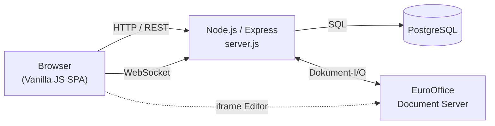

# myCloud

<div align="center">

**Eine moderne, schlichte und sichere Cloud-Lösung — vollständig selbstgehostet, vollständig unter deiner Kontrolle.**

[](app/package.json)
[](docker-compose.yml)
[](app/package.json)
[](docker-compose.yml)

</div>

---

myCloud ist ein Node/Express-Monolith mit schlankem Vanilla-JS-Frontend — kein Framework, kein Bundler, keine Abhängigkeit von externen Diensten. Alles läuft in deinem eigenen Docker-Compose-Stack: Dateiverwaltung, Freigabe-Links, Office-Bearbeitung, Echtzeit-Kollaboration und eine vollständige Admin-Konsole.

## Inhalt

- [Features](#features)
- [Architektur](#architektur)
- [Schnellstart](#schnellstart)
- [Konfiguration](#konfiguration-umgebungsvariablen)
- [Versionierung](#versionierung)
- [Screenshots](#screenshots)
- [Tech-Stack](#tech-stack)

## Features

### Dateiverwaltung
- Datei-Explorer mit Grid-/Listenansicht, Drag & Drop, Mehrfachauswahl, Papierkorb (konfigurierbare Aufbewahrungsdauer)
- Volltextsuche (Dateinamen + Inhalt/OCR) mit "intelligenter Suche" (Fuzzy-Matching)
- Vorschau direkt im Browser: Bilder, Videos (mit eigenem HUD-Player), PDF (Zwei-Seiten-Modus), Code/Markdown mit Syntax-Highlighting
- **Office-Dokumente** (Word/Excel/PowerPoint) werden über eine integrierte **EuroOffice**-Instanz geöffnet und bearbeitet — kein Download nötig
- **Echtzeit-Kollaboration** beim Bearbeiten von Code- und Office-Dateien (WebSocket-basiert, mit Cursor-Anzeige anderer Nutzer)

### Freigabe & Sicherheit
- Freigabe-Links mit granularen Rechten (Lesen, Schreiben/Upload, Download, ZIP-Export), Passwortschutz, Ablaufdatum, Download-Limit
- Selbstzerstörende Einmalnachrichten (inkl. Datei-Anhängen)
- Mehrstufige Authentifizierung: Passwort, **Passkeys** (WebAuthn), **SSO/OIDC** (Authentik-kompatibel) — inklusive automatischer Weiterleitung und optionalem "Nur SSO"-Modus
- Rollenbasierte Berechtigungen mit Speicherkontingenten pro Nutzer oder Gruppe

### Admin-Konsole
- Branding: Cloud-Name, Farben, Icon, Hintergrundbilder, Footer
- **SEO & Sichtbarkeit**: Titel, Beschreibung und Open-Graph-Vorschaubild frei einstellbar, plus Schalter für Suchmaschinen-Indexierung (Standard: privat)
- **Versionserkennung**: Software, `.env` und `docker-compose.yml` werden unabhängig versioniert und auf Aktualität geprüft — inklusive manuellem GitHub-Update-Check
- SMTP-Konfiguration, Benutzer- und Rollenverwaltung, Passwort-Reset per E-Mail

## Architektur



Ein einzelner Node-Prozess bedient jede HTTP-Route, den WebSocket-Server und alle Hintergrund-Jobs (`server.js`). Postgres ist die einzige Datenquelle, EuroOffice läuft als eigener Container ausschließlich für die Office-Vorschau/-Bearbeitung.

## Schnellstart

**Voraussetzungen:** Docker & Docker Compose (für lokale Entwicklung außerhalb von Docker zusätzlich Node.js).

```bash
# 1. Repository klonen
git clone https://github.com/CtrlCup/myCloud.git
cd myCloud

# 2. Umgebungsvariablen einrichten
cp .env.example .env
# .env nach Bedarf anpassen (siehe Konfiguration unten)

# 3. Starten
docker compose up --build
```

Danach ist myCloud unter `http://localhost:3030` erreichbar (Port über `PORT` in `.env` änderbar). **Der erste registrierte Benutzer wird automatisch zum Admin.**

## Konfiguration (Umgebungsvariablen)

Alle Variablen sind optional und lassen sich alternativ bequem über die **Admin-Einstellungen** in der Weboberfläche setzen — Änderungen dort werden automatisch in die `.env`-Datei zurückgeschrieben.

<details>
<summary><strong>Standardkonfiguration</strong></summary>

| Variable | Beschreibung | Standard |
|---|---|---|
| `PORT` | Port, auf dem die App läuft | `3030` |
| `APP_URL` | Öffentliche URL der Instanz | `http://localhost:3030` |
| `SESSION_SECRET` | Zufälliger, sicherer String zur Session-Absicherung | — |
| `DB_USER` / `DB_PASSWORD` / `DB_NAME` | PostgreSQL-Zugangsdaten | `mycloud` |
| `REGISTRATION_ENABLED` | Selbstregistrierung über die Anmeldeseite erlauben | `true` |

</details>

<details>
<summary><strong>Mailserver / SMTP</strong></summary>

| Variable | Beschreibung |
|---|---|
| `EMAIL_SMTP_HOST` | Hostname des SMTP-Servers (z. B. `smtp.gmail.com`) |
| `EMAIL_SMTP_PORT` | SMTP-Port (z. B. `587` oder `465`) |
| `EMAIL_SMTP_USER` / `EMAIL_SMTP_PASS` | Zugangsdaten |
| `EMAIL_FROM` | Absender-Adresse (Standard: `noreply@mycloud.local`) |

</details>

<details>
<summary><strong>SSO / OIDC</strong></summary>

| Variable | Beschreibung |
|---|---|
| `SSO_ENABLED` | SSO-Login aktivieren (`true` / `false`) |
| `SSO_CLIENT_ID` / `SSO_CLIENT_SECRET` | Zugangsdaten deines OIDC-Providers (z. B. Authentik) |
| `SSO_ISSUER_URL` | Issuer-URL des Providers |
| `SSO_REDIRECT_URI` | Callback-URL (Standard: `http://localhost:3030/auth/sso/callback`) |

</details>

## Versionierung

myCloud versioniert drei Dinge unabhängig voneinander:

| | Version liegt in | Wird geprüft gegen |
|---|---|---|
| **Software** | [`app/package.json`](app/package.json) | — (aktuell laufende Version) |
| **`.env`** | `ENV_VERSION`-Zeile in der Datei | erwartete Version in `app/version.js` |
| **`docker-compose.yml`** | `COMPOSE_VERSION`-Kommentar in der Datei | erwartete Version in `app/version.js` |

Die Admin-Konsole zeigt alle drei an und warnt (im Log beim Start sowie sichtbar in den Systemeinstellungen), sobald `.env` oder `docker-compose.yml` älter sind als der Softwarestand erwartet — inklusive eines manuellen "Jetzt prüfen"-Buttons für Software-Updates auf GitHub.

## Screenshots

*(Folgen in Kürze.)* Möchtest du selbst welche beisteuern: Screenshot in `docs/screenshots/` ablegen und per
`` in dieser README verlinken.

## Tech-Stack

**Backend:** Node.js, Express, PostgreSQL, WebSocket (`ws`), `bcryptjs`, `@simplewebauthn/server`
**Frontend:** Vanilla JavaScript, kein Framework/Bundler — reines `styles.css` für das gesamte Theming
**Editoren:** [PDF.js](https://github.com/mozilla/pdf.js) (PDF-Vorschau), EuroOffice (Office-Dokumente), Monaco (Code)
**Infrastruktur:** Docker Compose — App, PostgreSQL, EuroOffice Document Server
