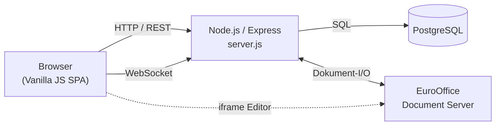

# myCloud

<div align="center">

**Eine moderne, schlichte und sichere Cloud-Lösung — vollständig selbstgehostet, vollständig unter deiner Kontrolle.**

[](app/package.json)
[](docker-compose.yml)
[](app/package.json)
[](docker-compose.yml)

</div>

---

myCloud ist ein Node/Express-Monolith mit schlankem Vanilla-JS-Frontend — kein Framework, kein Bundler, keine Abhängigkeit von externen Diensten. Alles läuft in deinem eigenen Docker-Compose-Stack: Dateiverwaltung, Freigabe-Links, Office-Bearbeitung, Echtzeit-Kollaboration und eine vollständige Admin-Konsole.

## Inhalt

- [Features](#features)
- [Architektur](#architektur)
- [Schnellstart](#schnellstart)
- [Konfiguration](#konfiguration-umgebungsvariablen)
- [API & KI-Zugriff](#api--ki-zugriff)
- [Verschlüsselung (optional)](#verschlüsselung-optional)
- [Update-Hinweise](#update-hinweise)
- [Versionierung](#versionierung)
- [Tests](#tests)
- [Screenshots](#screenshots)
- [Tech-Stack](#tech-stack)

## Features

### Dateiverwaltung
- Datei-Explorer mit Grid-/Listenansicht, Drag & Drop, Mehrfachauswahl, Papierkorb (konfigurierbare Aufbewahrungsdauer)
- Volltextsuche (Dateinamen + Inhalt/OCR) mit "intelligenter Suche" (Fuzzy-Matching)
- Vorschau direkt im Browser: Bilder, Videos (mit eigenem HUD-Player), PDF (Zwei-Seiten-Modus), Code/Markdown mit Syntax-Highlighting
- **Office-Dokumente** (Word/Excel/PowerPoint) werden über eine integrierte **EuroOffice**-Instanz geöffnet und bearbeitet — kein Download nötig
- **Echtzeit-Kollaboration** beim Bearbeiten von Code- und Office-Dateien (WebSocket-basiert, mit Cursor-Anzeige anderer Nutzer)

### Freigabe & Sicherheit
- Freigabe-Links mit granularen Rechten (Lesen, Schreiben/Upload, Download, ZIP-Export), Passwortschutz, Ablaufdatum, Download-Limit
- Reine **Download-Freigaben** („Nur Herunterladen“): Der Empfänger kann die Datei laden, aber nicht in der Vorschau öffnen
- Selbstzerstörende Einmalnachrichten (inkl. Datei-Anhängen)
- Mehrstufige Authentifizierung: Passwort, **Passkeys** (WebAuthn), **SSO/OIDC** (Authentik-kompatibel) — inklusive automatischer Weiterleitung und optionalem "Nur SSO"-Modus
- Bestehende Konten lassen sich mit SSO **verknüpfen** (automatisch bei vom Provider bestätigter E-Mail, sonst manuell unter *Einstellungen → Mit SSO verknüpfen*)
- Gehärtete Datei-Auslieferung: Dateitypen werden serverseitig bestimmt (aktive Inhalte wie HTML werden nie als Webseite ausgeliefert), Avatare per Magic-Bytes geprüft, Dateien im Papierkorb sind auch über Freigaben nicht erreichbar
- Rollenbasierte Berechtigungen mit Speicherkontingenten pro Nutzer oder Gruppe

### Admin-Konsole
- Branding: Cloud-Name, Farben, Icon, Hintergrundbilder, Footer
- **SEO & Sichtbarkeit**: Titel, Beschreibung und Open-Graph-Vorschaubild frei einstellbar, plus Schalter für Suchmaschinen-Indexierung (Standard: privat)
- **Versionserkennung**: Software, `.env` und `docker-compose.yml` werden unabhängig versioniert und auf Aktualität geprüft — inklusive manuellem GitHub-Update-Check
- SMTP-Konfiguration, Benutzer- und Rollenverwaltung, Passwort-Reset per E-Mail
- **API-Zugriff** per persönlichem API-Key lässt sich instanzweit ein-/ausschalten (siehe [API & KI-Zugriff](#api--ki-zugriff))

## Architektur


```mermaid
graph LR
    Browser["Browser<br/>(Vanilla JS SPA)"] -->|HTTP / REST| App["Node.js / Express<br/>server.js"]
    Browser -->|WebSocket| App
    App -->|SQL| DB[("PostgreSQL")]
    App <-->|Dokument-I/O| EuroOffice["EuroOffice<br/>Document Server"]
    Browser -.->|iframe Editor| EuroOffice
```

Ein einzelner Node-Prozess bedient jede HTTP-Route, den WebSocket-Server und alle Hintergrund-Jobs (`server.js`). Postgres ist die einzige Datenquelle, EuroOffice läuft als eigener Container ausschließlich für die Office-Vorschau/-Bearbeitung.

## Schnellstart

**Voraussetzungen:** Docker & Docker Compose (für lokale Entwicklung außerhalb von Docker zusätzlich Node.js).

```bash
# 1. Repository klonen
git clone https://github.com/CtrlCup/myCloud.git
cd myCloud

# 2. Umgebungsvariablen und Docker-Compose-Datei einrichten
cp .env.example .env
cp docker-compose.example.yml docker-compose.yml
# .env nach Bedarf anpassen (siehe Konfiguration unten)

# 3. Starten
docker compose up --build
```

Danach ist myCloud unter `http://localhost:3030` erreichbar (Port über `PORT` in `.env` änderbar). **Der erste registrierte Benutzer wird automatisch zum Admin.**

## Konfiguration (Umgebungsvariablen)

Alle Variablen sind optional und lassen sich alternativ bequem über die **Admin-Einstellungen** in der Weboberfläche setzen — Änderungen dort werden automatisch in die `.env`-Datei zurückgeschrieben.

<details>
<summary><strong>Standardkonfiguration</strong></summary>

| Variable | Beschreibung | Standard |
|---|---|---|
| `PORT` | Port, auf dem die App läuft | `3030` |
| `APP_URL` | Öffentliche URL der Instanz | `http://localhost:3030` |
| `SESSION_SECRET` | Zufälliger, sicherer String zur Session-Absicherung | — |
| `DB_USER` / `DB_PASSWORD` / `DB_NAME` | PostgreSQL-Zugangsdaten | `mycloud` |
| `REGISTRATION_ENABLED` | Selbstregistrierung über die Anmeldeseite erlauben | `true` |
| `TRUST_PROXY` | Welchen Reverse-Proxys die App bei `X-Forwarded-For`/`-Proto` vertraut, siehe [Reverse-Proxy](#reverse-proxy-trust_proxy) | `loopback, linklocal, uniquelocal` |

</details>

<details>
<summary><strong>Mailserver / SMTP</strong></summary>

| Variable | Beschreibung |
|---|---|
| `EMAIL_SMTP_HOST` | Hostname des SMTP-Servers (z. B. `smtp.gmail.com`) |
| `EMAIL_SMTP_PORT` | SMTP-Port (z. B. `587` oder `465`) |
| `EMAIL_SMTP_USER` / `EMAIL_SMTP_PASS` | Zugangsdaten |
| `EMAIL_FROM` | Absender-Adresse (Standard: `noreply@mycloud.local`) |

</details>

<details>
<summary><strong>SSO / OIDC</strong></summary>

| Variable | Beschreibung |
|---|---|
| `SSO_ENABLED` | SSO-Login aktivieren (`true` / `false`) |
| `SSO_CLIENT_ID` / `SSO_CLIENT_SECRET` | Zugangsdaten deines OIDC-Providers (z. B. Authentik) |
| `SSO_ISSUER_URL` | Issuer-URL des Providers |

Die Callback-URL (`.../auth/sso/callback`) ist nicht konfigurierbar — sie wird aus der Domain
abgeleitet, unter der der Login-Flow aufgerufen wurde (identisch zur schreibgeschützten Anzeige
unter „Redirect URI (Callback)“ in den Admin-Einstellungen). Genau dieser Wert muss 1:1 als
Redirect-URI im OIDC-Provider (z. B. Authentik) hinterlegt sein.

</details>

### Reverse-Proxy (`TRUST_PROXY`)

Die App leitet die Client-IP (u. a. für das Registrierungs-Limit) aus `X-Forwarded-For` ab. Damit
niemand diesen Header fälschen kann, vertraut sie **nur Proxys aus lokalen oder privaten Netzen**
(Loopback, Link-Local, private Adressbereiche). Das passt für Caddy/Nginx auf demselben Host oder
im Docker-Netz, ohne dass du etwas einstellen musst.

| Setup | Empfohlener Wert |
|---|---|
| Proxy auf demselben Host / im Docker-Netz | nichts setzen (Standard) |
| Proxy oder CDN mit **öffentlicher** Adresse (z. B. Cloudflare, externer Load-Balancer) | `TRUST_PROXY=<IP/CIDR-Liste>` oder die Anzahl der Proxy-Hops, z. B. `1` |
| App direkt ohne Proxy erreichbar (Port frei veröffentlicht) | `TRUST_PROXY=false` oder den Port nur an `127.0.0.1` binden |

`TRUST_PROXY=true` vertraut jeder Quelle und macht Client-IPs fälschbar — nicht empfohlen. Die Variable
muss in `docker-compose.yml` unter `app.environment` durchgereicht werden (siehe
`docker-compose.example.yml`, dort auskommentiert vorbereitet).

## API & KI-Zugriff

myCloud hat keine separate "App-API" — dieselbe REST-API, die auch das Web-UI (`app.js`) antreibt,
lässt sich vollständig extern nutzen:

- **Dokumentation:** OpenAPI-3.0-Spezifikation unter [`app/openapi.yaml`](app/openapi.yaml), interaktiv
  ausprobierbar über die Swagger-UI unter `/api/docs`.
- **Authentifizierung per API-Key:** In den persönlichen Einstellungen lässt sich ein Key
  (`Authorization: Bearer mcld_...`) erzeugen, der einem externen Client exakt dieselben Rechte wie
  dem erstellenden Benutzer gibt — bei Admins also auch Zugriff auf alle Admin-Funktionen.
  Ausnahme: Funktionen, die das Konto selbst absichern (API-Keys verwalten, 2FA, Passkeys, Passwort,
  Profil), sind mit einem Key bewusst gesperrt und nur im Browser möglich. Die Key-Authentifizierung
  ist zustandslos: Es entsteht keine Session und kein Cookie, ein widerrufener Key verliert sofort
  jeden Zugriff.
- **Für KI-Agenten:** [`docs/KI-Zugriff.md`](docs/KI-Zugriff.md) beschreibt, wie sich die eigene
  Instanz per KI-Assistent (Claude, ChatGPT & Co.) einrichten, personalisieren und im Alltag
  bedienen lässt.
- **Global abschaltbar:** Ein Admin kann API-Key-Authentifizierung instanzweit deaktivieren
  (**Admin-Einstellungen → Registrierung & SSO → API-Zugriff**), ohne bestehende Keys zu löschen —
  Session-Cookie-Logins im Browser bleiben davon unberührt.

## Verschlüsselung (optional)

myCloud kann Dateien mit einem Master-Key verschlüsselt ablegen (AES-256-GCM, Konzept: [`docs/Verschluesselung-und-Backup.md`](docs/Verschluesselung-und-Backup.md)). Mit aktivem Master-Key werden alle neuen Dateien, Thumbnails und Avatare verschlüsselt gespeichert, bestehende Dateien werden im Hintergrund migriert (siehe unten). Ohne Master-Key verhält sich die App unverändert (Branding-Bilder bleiben bewusst Klartext, Spalten-Verschlüsselung folgt in einer späteren Phase).

1. Key erzeugen (die Datei bekommt Modus `0400`, ein vorhandener Key wird nie überschrieben):
   ```bash
   mkdir -p secrets
   docker compose run --rm --no-deps -v ./secrets:/out app node scripts/keys.js init --out /out/master_key
   ```
   `--out` ist Pflicht. Die Datei gehört danach dem Container-User (root); für das Docker-Secret aus einer Host-Datei auf Modus `0400`/`0440` und den Besitzer achten (ggf. `sudo chown $USER secrets/master_key`). Alternativ lokal: `cd app && node scripts/keys.js init --out ../secrets/master_key`.
2. **Recovery-Code sichern:** Die Ausgabe enthält einmalig einen Recovery-Code (Base32 in 4er-Gruppen), der den Master-Key enthält. Offline ablegen (z. B. Passwortmanager), nicht in CI-Logs oder Terminal-Mitschnitten. Erneut anzeigen: `node scripts/keys.js show-recovery <datei>`, Format prüfen: `node scripts/keys.js check <datei>`.
3. **Ohne Master-Key sind verschlüsselte Daten unwiederbringlich verloren.** Die Key-Datei gehört nicht ins Repository (und nicht in dieselbe Sicherung wie die Daten).
4. Docker-Secret aktivieren: in `docker-compose.yml` die auskommentierten Zeilen `secrets: [master_key]`, `MYCLOUD_MASTER_KEY_FILE: /run/secrets/master_key`, den `secrets:`-Block am Ende sowie `tmpfs` und `MYCLOUD_TMP_DIR` (entschlüsselte Temp-Dateien nur im RAM) einkommentieren, dann `docker compose up -d`.

**Migration bestehender Dateien:** Beim Start mit Key verschlüsselt ein Hintergrund-Job alle noch unverschlüsselten Dateien (auch im Papierkorb). Er ist fortsetzbar und idempotent (nach einem Neustart läuft er einfach weiter), prüft jeden neuen Blob per Entschlüsselung und Hash, bevor er die Datei umhängt, und löscht den Klartext erst danach. Klartext-Thumbnails werden gelöscht (sie entstehen verschlüsselt neu), Klartext-Avatare werden verschlüsselt. Der Fortschritt steht unter **Admin-Einstellungen → Systemeinstellungen → Verschlüsselung** (dort lässt sich der Job auch starten und stoppen; Status per `GET /api/settings/admin/encryption-status`). Last und Tempo: `MYCLOUD_MIGRATION_CONCURRENCY` (Standard 1) und `MYCLOUD_MIGRATION_PAUSE_MS` (Standard 50). Automatischen Start abschalten: Einstellung `encryption_auto_migrate` = `false`. Alte Blobs werden über eine Outbox-Tabelle (`pending_blob_deletes`) gelöscht, die nach einem Absturz beim nächsten Start abgearbeitet wird. Dateien mit fehlendem Blob oder abweichender Größe werden als „fehlend“ bzw. „fehlgeschlagen“ gezählt, nicht angefasst und brauchen eine manuelle Prüfung.

- **Vor der Aktivierung ein Backup anlegen.** Die Migration verändert den Datenbestand.
- **Alte Backups und Snapshots enthalten weiterhin Klartext.** Erst nach der Migration angelegte Sicherungen sind verschlüsselt; ältere gezielt löschen oder selbst verschlüsseln.
- Zusätzlich empfohlen: Volume-/Festplattenverschlüsselung (LUKS/ZFS) für die Datenbank und das Upload-Volume; Datenbankinhalte sind (bis Phase P3) nicht verschlüsselt.

Beim ersten Start mit Key speichert die App einen Prüfwert in der Datenbank. Passt der Key später nicht (oder fehlt er bei einer schon verschlüsselten Instanz), beendet sich die App mit einer Fehlermeldung, statt Dateien unlesbar zu machen. Die Key-Datei enthält 32 Bytes als Hex oder Base64 (eine Zeile) oder JSON `{ "current": 1, "keys": { "1": "<hex>" } }` für spätere Schlüsselrotation.

## Update-Hinweise

Wichtige Änderungen, die beim Aktualisieren relevant sein können (Details jeweils in den Commits und Issues):

### 0.4.30
- **Datenbank-Start:** Die App wartet beim Start auf PostgreSQL (10 Versuche mit Backoff) und beendet sich nicht mehr beim ersten Versuch. In `docker-compose.example.yml` gibt es zusätzlich einen optionalen Healthcheck für die Datenbank.
- **E-Mail-Adressen** werden klein geschrieben gespeichert und beim Login ohne Rücksicht auf die Schreibweise verglichen. Beim Start werden bestehende Adressen einmalig normalisiert; Konten mit nur in der Schreibweise abweichenden Adressen bleiben unangetastet und werden im Log gemeldet.
- **SSO:** Neue SSO-Nutzer erhalten die eingestellte Standardrolle sowie E-Mail und Name vom Provider. Bestehende Konten werden bei einer vom Provider als verifiziert gemeldeten E-Mail automatisch verknüpft.
- **Office-Speichern** (EuroOffice) schreibt wieder zuverlässig zurück; der Dokument-Schlüssel wechselt nach jedem Speichern.
- Textdateien über 100 KB lassen sich im Editor speichern (bis 20 MB), ZIP-Downloads enthalten keine Papierkorb-Dateien mehr, „Nur Herunterladen“-Freigaben funktionieren, Ordner lassen sich kopieren.

### 0.4.29 — Sicherheits-Härtung
- **Neuer Standard bei `TRUST_PROXY`:** Es werden nur noch Proxys aus privaten oder lokalen Netzen vertraut. **Hinter einem öffentlich erreichbaren Proxy oder CDN musst du `TRUST_PROXY` setzen**, sonst sieht die App nur die Proxy-IP (siehe [Reverse-Proxy](#reverse-proxy-trust_proxy)).
- Hochgeladene Dateien werden nie mit aktivem Inhaltstyp (HTML/XML) ausgeliefert, SVG nur in einer Sandbox. Bereits gespeicherte Dateien werden beim Start entsprechend korrigiert.
- Avatare müssen echte Bilder (PNG, JPEG, GIF, WebP) sein.
- API-Keys erzeugen keine Browser-Session mehr (siehe [API & KI-Zugriff](#api--ki-zugriff)).
- Dateien im Papierkorb sind über Freigabe-Links nicht mehr abrufbar.

Beide Versionen erfordern **keine** Änderung an `.env` oder `docker-compose.yml`.

## Versionierung

myCloud versioniert drei Dinge unabhängig voneinander:

| | Version liegt in | Wird geprüft gegen |
|---|---|---|
| **Software** | [`app/package.json`](app/package.json) | — (aktuell laufende Version) |
| **`.env`** | `ENV_VERSION`-Zeile in der Datei | erwartete Version in `app/version.js` |
| **`docker-compose.yml`** | `COMPOSE_VERSION`-Kommentar in der Datei | erwartete Version in `app/version.js` |

Die Admin-Konsole zeigt alle drei an und warnt (im Log beim Start sowie sichtbar in den Systemeinstellungen), sobald `.env` oder `docker-compose.yml` älter sind als der Softwarestand erwartet — inklusive eines manuellen "Jetzt prüfen"-Buttons für Software-Updates auf GitHub.

## Tests

Es gibt keine Build- oder Lint-Schritte, aber automatisierte Tests unter [`tests/`](tests/) (`node:test`) gegen einen
isolierten Test-Stack mit eigener Datenbank im RAM und Port `3099` — die echte Entwicklungs-DB bleibt unberührt:

```bash
docker compose -p mycloudtest -f tests/docker-compose.test.yml up --build -d
./tests/run-all.sh      # startet die App vor jeder Testdatei neu, Exit-Code 0 = alles grün
docker compose -p mycloudtest -f tests/docker-compose.test.yml down -v
```

`run-all.sh` ist nötig, weil das Registrierungs-Limit (5 pro Stunde) im Speicher des App-Prozesses liegt und sonst nach wenigen Testdateien greift.

## Screenshots

*(Folgen in Kürze.)* Möchtest du selbst welche beisteuern: Screenshot in `docs/screenshots/` ablegen und per
`` in dieser README verlinken.

## Tech-Stack

**Backend:** Node.js, Express, PostgreSQL, WebSocket (`ws`), `bcryptjs`, `@simplewebauthn/server`
**Frontend:** Vanilla JavaScript, kein Framework/Bundler — reines `styles.css` für das gesamte Theming
**Editoren:** [PDF.js](https://github.com/mozilla/pdf.js) (PDF-Vorschau), EuroOffice (Office-Dokumente), Monaco (Code)
**Infrastruktur:** Docker Compose — App, PostgreSQL, EuroOffice Document Server
